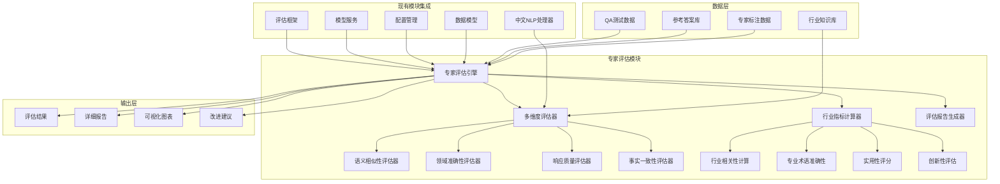

# 设计文档

## 概述

专家模型评估系统是一个全面的行业化评估框架，专门用于评估训练后已合并的最终模型。该系统基于现有的评估框架、模型服务和配置管理模块，提供比传统BLEU、ROUGE更适合行业场景的多维度评估能力。系统采用模块化设计，支持自动化评估引擎，并提供可靠、有效、公允的评估方法。

## 架构

### 系统架构图



### 模块依赖关系

- **专家评估引擎**: 核心协调模块，依赖现有的评估框架和模型服务
- **多维度评估器**: 扩展现有的ProfessionalAccuracyEvaluator和ChineseSemanticEvaluator
- **行业指标计算器**: 新增的行业特定评估组件
- **评估报告生成器**: 基于现有的报告生成功能扩展

## 组件和接口

### 1. 专家评估引擎 (ExpertEvaluationEngine)

```python
class ExpertEvaluationEngine:
    def __init__(self, config: ExpertEvaluationConfig)
    def load_model(self, model_path: str) -> bool
    def evaluate_model(self, qa_data: List[QAItem]) -> ExpertEvaluationResult
    def batch_evaluate(self, qa_datasets: List[QADataset]) -> BatchEvaluationResult
    def generate_report(self, results: ExpertEvaluationResult) -> EvaluationReport
```

**接口说明:**
- `load_model()`: 加载已合并的最终模型，集成现有的ModelService
- `evaluate_model()`: 执行单个QA数据集的评估
- `batch_evaluate()`: 批量评估多个数据集
- `generate_report()`: 生成详细的评估报告

### 2. 行业指标计算器 (IndustryMetricsCalculator)

```python
class IndustryMetricsCalculator:
    def calculate_domain_relevance(self, answer: str, domain_context: str) -> float
    def assess_practical_applicability(self, answer: str, use_case: str) -> float
    def evaluate_innovation_level(self, answer: str, baseline_answers: List[str]) -> float
    def measure_completeness(self, answer: str, question_requirements: List[str]) -> float
```

**接口说明:**
- `calculate_domain_relevance()`: 计算答案与特定领域的相关性
- `assess_practical_applicability()`: 评估实际应用价值
- `evaluate_innovation_level()`: 评估创新性和独特性
- `measure_completeness()`: 测量回答的完整性

### 3. 高级语义评估器 (AdvancedSemanticEvaluator)

```python
class AdvancedSemanticEvaluator:
    def calculate_semantic_depth(self, answer: str, reference: str) -> float
    def assess_logical_consistency(self, answer: str) -> float
    def evaluate_contextual_understanding(self, answer: str, context: str) -> float
    def measure_concept_coverage(self, answer: str, key_concepts: List[str]) -> float
```

**接口说明:**
- `calculate_semantic_depth()`: 计算语义深度，超越表面相似性
- `assess_logical_consistency()`: 评估逻辑一致性
- `evaluate_contextual_understanding()`: 评估上下文理解能力
- `measure_concept_coverage()`: 测量关键概念覆盖度

### 4. 评估数据管理器 (EvaluationDataManager)

```python
class EvaluationDataManager:
    def load_qa_data(self, data_path: str) -> List[QAItem]
    def validate_data_format(self, qa_data: List[QAItem]) -> ValidationResult
    def prepare_evaluation_dataset(self, raw_data: List[Dict]) -> EvaluationDataset
    def export_results(self, results: ExpertEvaluationResult, format: str) -> str
```

**接口说明:**
- `load_qa_data()`: 加载QA格式的测试数据
- `validate_data_format()`: 验证数据格式的正确性
- `prepare_evaluation_dataset()`: 准备评估数据集
- `export_results()`: 导出评估结果到不同格式

## 数据模型

### 1. 专家评估配置 (ExpertEvaluationConfig)

```python
@dataclass
class ExpertEvaluationConfig:
    model_path: str
    evaluation_dimensions: List[EvaluationDimension]
    industry_weights: Dict[str, float]
    threshold_settings: Dict[str, float]
    output_format: str
    enable_detailed_analysis: bool
    comparison_baseline: Optional[str]
```

### 2. QA评估项 (QAEvaluationItem)

```python
@dataclass
class QAEvaluationItem:
    question_id: str
    question: str
    context: Optional[str]
    reference_answer: str
    model_answer: str
    domain_tags: List[str]
    difficulty_level: int
    expected_concepts: List[str]
```

### 3. 专家评估结果 (ExpertEvaluationResult)

```python
@dataclass
class ExpertEvaluationResult:
    overall_score: float
    dimension_scores: Dict[EvaluationDimension, float]
    industry_metrics: Dict[str, float]
    detailed_feedback: Dict[str, str]
    improvement_suggestions: List[str]
    confidence_intervals: Dict[str, Tuple[float, float]]
    statistical_significance: Dict[str, float]
```

### 4. 评估维度枚举 (EvaluationDimension)

```python
class EvaluationDimension(Enum):
    SEMANTIC_SIMILARITY = "语义相似性"
    DOMAIN_ACCURACY = "领域准确性"
    RESPONSE_RELEVANCE = "响应相关性"
    FACTUAL_CORRECTNESS = "事实正确性"
    COMPLETENESS = "完整性"
    INNOVATION = "创新性"
    PRACTICAL_VALUE = "实用价值"
    LOGICAL_CONSISTENCY = "逻辑一致性"
```

## 错误处理

### 1. 模型加载错误处理

```python
class ModelLoadError(Exception):
    """模型加载失败异常"""
    pass

class EvaluationError(Exception):
    """评估过程异常"""
    pass

class DataFormatError(Exception):
    """数据格式错误异常"""
    pass
```

### 2. 错误恢复策略

- **模型加载失败**: 提供详细错误信息，建议检查模型路径和格式
- **评估过程异常**: 记录失败的具体项目，继续处理其余项目
- **数据格式错误**: 提供数据修复建议，支持部分数据处理
- **内存不足**: 自动调整批处理大小，启用渐进式评估

### 3. 降级处理机制

- **高级指标计算失败**: 回退到基础指标
- **外部依赖不可用**: 使用内置的简化算法
- **GPU资源不足**: 自动切换到CPU模式
- **网络连接问题**: 使用本地缓存的参考数据

## 测试策略

### 1. 单元测试

- **评估器组件测试**: 测试各个评估维度的计算准确性
- **数据处理测试**: 验证QA数据的加载和预处理
- **配置管理测试**: 测试配置的加载和验证
- **错误处理测试**: 验证异常情况的处理

### 2. 集成测试

- **端到端评估测试**: 完整的模型评估流程测试
- **多模型比较测试**: 测试不同模型的评估结果
- **大规模数据测试**: 验证批量评估的性能和准确性
- **现有模块集成测试**: 确保与现有系统的兼容性

### 3. 性能测试

- **评估速度基准**: 测量不同规模数据的评估时间
- **内存使用监控**: 监控评估过程的内存消耗
- **并发处理测试**: 测试多线程评估的稳定性
- **资源利用率测试**: 优化GPU和CPU的使用效率

### 4. 准确性验证

- **专家标注对比**: 与人工专家评估结果对比
- **跨领域验证**: 在不同行业领域验证评估准确性
- **一致性测试**: 验证重复评估的结果一致性
- **偏差检测**: 检测和纠正评估偏差

## 实现细节

### 1. 现有模块集成策略

- **评估框架扩展**: 继承ComprehensiveEvaluationFramework，添加行业特定评估器
- **模型服务集成**: 利用ModelService的模型加载和推理能力
- **配置管理复用**: 扩展ConfigManager支持专家评估配置
- **中文处理增强**: 基于ChineseNLPProcessor增加行业术语处理

### 2. 性能优化

- **批处理优化**: 实现智能批处理，平衡内存使用和处理速度
- **缓存机制**: 缓存模型推理结果和中间计算结果
- **并行计算**: 利用多线程和GPU加速评估计算
- **渐进式评估**: 支持大数据集的分块处理

### 3. 可扩展性设计

- **插件架构**: 支持新评估维度的动态添加
- **配置驱动**: 通过配置文件调整评估策略
- **API接口**: 提供RESTful API支持外部系统集成
- **模块化设计**: 各组件独立，便于单独测试和维护

### 4. 数据安全和隐私

- **数据加密**: 敏感评估数据的加密存储
- **访问控制**: 实现基于角色的访问控制
- **审计日志**: 记录所有评估操作的详细日志
- **数据脱敏**: 支持敏感信息的自动脱敏处理