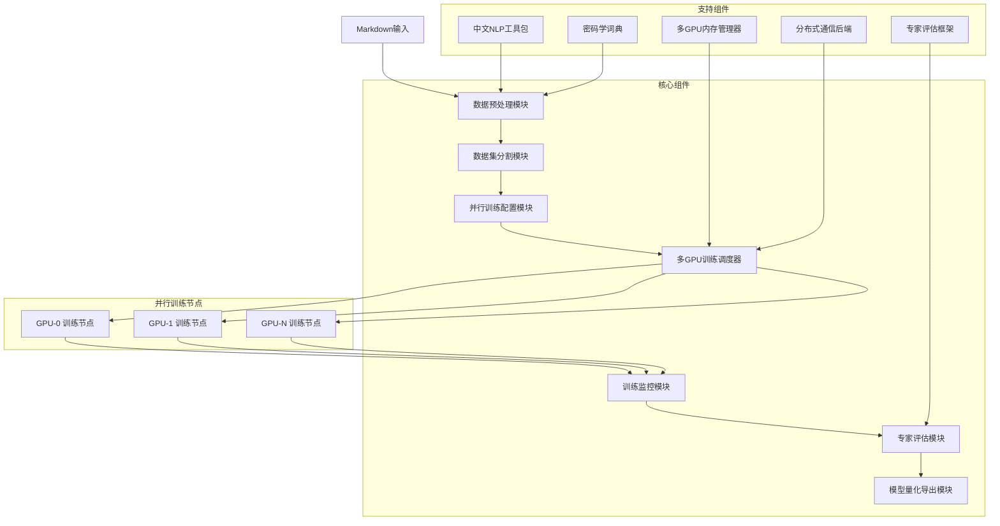

# 设计文档

## 概述

本系统基于LLaMA Factory框架构建，专门针对Qwen/Qwen3-4B-Thinking-2507模型的中文密码学领域微调需求。系统采用模块化架构，支持从markdown数据预处理到模型量化导出的完整工作流，特别支持深度思考(thinking)数据格式的处理和微调。核心设计理念是内存效率优先、多GPU并行训练、专业领域适配和专家级评估标准。

系统支持多种并行训练策略：数据并行(DDP)、模型并行(MP)、流水线并行(PP)和混合并行，能够充分利用多显卡资源进行高效训练。系统主要组件包括：深度思考数据处理模块、Qwen模型适配模块、并行训练管理模块、监控评估模块和模型导出模块。每个模块都针对Qwen3-4B-Thinking模型特性、中文文本处理、密码学专业术语、thinking推理模式和多GPU环境进行了优化。

## 架构

### 整体架构图



### 系统层次结构

1. **应用层** - 用户接口和工作流编排
2. **业务逻辑层** - 数据处理、训练管理、评估逻辑
3. **框架适配层** - LLaMA Factory集成和扩展
4. **基础设施层** - GPU管理、存储、监控

## 组件和接口

### 1. 深度思考数据处理模块 (ThinkingDataProcessor)

**职责：**
- 解析markdown文件为结构化数据
- 处理和生成深度思考(thinking)数据格式
- 中文文本预处理和标准化
- 密码学术语识别和标注
- Qwen3-4B-Thinking模型数据适配

**核心接口：**
```python
class ThinkingDataProcessor:
    def parse_markdown(self, file_path: str) -> List[TrainingExample]
    def parse_thinking_tags(self, text: str) -> ThinkingStructure
    def generate_thinking_data(self, instruction: str, response: str) -> ThinkingExample
    def validate_thinking_format(self, thinking_text: str) -> ValidationResult
    def preprocess_chinese_text(self, text: str) -> str
    def extract_crypto_terms(self, text: str) -> List[CryptoTerm]
    def validate_qwen_format(self, dataset: Dataset) -> ValidationResult
```

**深度思考处理特性：**
- 支持多层嵌套`<thinking>`标签解析
- 自动生成合理的思考过程
- 思考逻辑连贯性验证
- 密码学推理过程生成

**中文处理特性：**
- 支持繁简体转换
- 中文分词和词性标注
- 标点符号规范化
- 专业术语词典匹配

### 2. 数据集分割模块 (DatasetSplitter)

**职责：**
- 智能数据集分割
- 保持专业术语分布均衡
- 语义完整性保护

**核心接口：**
```python
class DatasetSplitter:
    def split_dataset(self, dataset: Dataset, ratios: Tuple[float, float, float]) -> DatasetSplits
    def ensure_term_distribution(self, splits: DatasetSplits) -> DatasetSplits
    def validate_semantic_integrity(self, splits: DatasetSplits) -> bool
```

### 3. 并行训练配置模块 (ParallelTrainingConfigurator)

**职责：**
- 多GPU并行策略配置
- 动态LoRA参数配置
- 内存优化策略选择
- 中文tokenizer优化
- 分布式训练参数设置

**核心接口：**
```python
class ParallelTrainingConfigurator:
    def detect_gpu_topology(self) -> GPUTopology
    def configure_parallel_strategy(self, num_gpus: int, model_size: str) -> ParallelConfig
    def setup_data_parallel(self, world_size: int) -> DataParallelConfig
    def setup_model_parallel(self, tensor_parallel_size: int) -> ModelParallelConfig
    def configure_lora_params(self, gpu_memory: int, model_size: str) -> LoRAConfig
    def setup_mixed_precision(self) -> MixedPrecisionConfig
    def optimize_chinese_tokenizer(self, vocab_path: str) -> TokenizerConfig
    def calculate_optimal_batch_size(self, available_memory: int, num_gpus: int) -> int
    def setup_gradient_synchronization(self, parallel_config: ParallelConfig) -> SyncConfig
```

### 4. 多GPU训练调度器 (MultiGPUTrainingScheduler)

**职责：**
- 多GPU资源调度和负载均衡
- 分布式训练进程管理
- 跨GPU通信协调
- 故障检测和恢复

**核心接口：**
```python
class MultiGPUTrainingScheduler:
    def initialize_distributed_backend(self, backend: str = "nccl") -> bool
    def spawn_training_processes(self, world_size: int, config: ParallelConfig) -> List[Process]
    def coordinate_gradient_sync(self, gradients: Dict[int, torch.Tensor]) -> torch.Tensor
    def handle_gpu_failure(self, failed_gpu_id: int) -> RecoveryPlan
    def balance_workload(self, gpu_utilization: Dict[int, float]) -> LoadBalancePlan
    def cleanup_distributed_resources(self) -> None
```

### 5. 训练监控模块 (TrainingMonitor)

**职责：**
- 多GPU训练指标监控
- 分布式训练状态跟踪
- 中文特定指标计算
- 异常检测和预警
- GPU利用率和通信效率监控

**核心接口：**
```python
class TrainingMonitor:
    def monitor_distributed_training(self, trainers: Dict[int, Trainer]) -> DistributedTrainingMetrics
    def track_gpu_utilization(self, gpu_ids: List[int]) -> Dict[int, GPUMetrics]
    def monitor_communication_overhead(self, comm_stats: CommunicationStats) -> CommEfficiencyMetrics
    def calculate_chinese_metrics(self, predictions: List[str], targets: List[str]) -> ChineseMetrics
    def detect_training_anomalies(self, metrics: DistributedTrainingMetrics) -> List[Anomaly]
    def generate_distributed_training_report(self, metrics_history: List[DistributedTrainingMetrics]) -> TrainingReport
    def monitor_load_balance(self, gpu_workloads: Dict[int, float]) -> LoadBalanceMetrics
```

### 6. 多层次专业评估模块 (ComprehensiveEvaluationFramework)

**职责：**
- 多维度专业准确性评估
- 改进的中文语义相似性评估
- 专家QA数据集构建和管理
- 人在回路评估工作流程
- 标注者间一致性分析

**核心接口：**
```python
class ComprehensiveEvaluationFramework:
    def evaluate_model_response(self, question: str, model_answer: str, reference_answer: str) -> EvaluationResult
    def batch_evaluate(self, qa_pairs: List[Tuple[str, str, str]]) -> List[EvaluationResult]
    def generate_evaluation_report(self, results: List[EvaluationResult]) -> Dict[str, Any]

class ProfessionalAccuracyEvaluator:
    def evaluate_technical_accuracy(self, answer: str, reference: str, context: str) -> float
    def evaluate_conceptual_understanding(self, answer: str, question: str) -> float
    def evaluate_practical_applicability(self, answer: str, context: str) -> float

class ChineseSemanticEvaluator:
    def evaluate_semantic_similarity(self, answer: str, reference: str) -> float
    def evaluate_linguistic_quality(self, text: str) -> float

class ExpertQAManager:
    def register_expert(self, expert: ExpertProfile) -> bool
    def create_annotation_task(self, qa_item_id: str, expert_ids: List[str]) -> Optional[str]
    def submit_annotation(self, task_id: str, expert_id: str, annotation: Dict[str, Any]) -> bool
    def calculate_inter_annotator_agreement(self, task_id: str) -> Dict[str, float]
    def get_quality_control_report(self) -> Dict[str, Any]
```

**评估维度：**
- **技术准确性 (Technical Accuracy)**: 专业概念正确性、算法描述准确性、技术错误检测
- **概念理解 (Conceptual Understanding)**: 理解深度、概念关联性、解释完整性
- **实用性 (Practical Applicability)**: 应用场景覆盖、实现可行性、安全考虑
- **语言质量 (Linguistic Quality)**: 中文语法、流畅性、术语使用、表达清晰度
- **推理连贯性 (Reasoning Coherence)**: 逻辑连贯性、推理步骤、结论合理性

### 7. 模型导出模块 (ModelExporter)

**职责：**
- 多格式量化导出
- 中文处理能力验证
- 部署包生成

**核心接口：**
```python
class ModelExporter:
    def quantize_model(self, model: torch.nn.Module, format: QuantizationFormat) -> QuantizedModel
    def validate_chinese_capability(self, quantized_model: QuantizedModel) -> ValidationResult
    def export_deployment_package(self, model: QuantizedModel, metadata: ModelMetadata) -> DeploymentPackage
```

## 数据模型

### 核心数据结构

```python
@dataclass
class TrainingExample:
    instruction: str
    input: str
    output: str
    thinking: Optional[str]  # 深度思考过程
    crypto_terms: List[str]
    difficulty_level: int
    source_file: str

@dataclass
class ThinkingExample:
    instruction: str
    thinking_process: str  # <thinking>标签内的内容
    final_response: str
    crypto_terms: List[str]
    reasoning_steps: List[str]
    
@dataclass
class ThinkingStructure:
    raw_thinking: str
    parsed_steps: List[str]
    reasoning_chain: List[ReasoningStep]
    validation_result: bool

@dataclass
class CryptoTerm:
    term: str
    definition: str
    category: str  # 对称加密、非对称加密、哈希函数等
    complexity: int

@dataclass
class ChineseMetrics:
    character_accuracy: float
    word_accuracy: float
    rouge_l_chinese: float
    bleu_chinese: float
    crypto_term_accuracy: float

@dataclass
class LoRAConfig:
    rank: int
    alpha: int
    target_modules: List[str]
    dropout: float
    memory_efficient: bool

@dataclass
class ParallelConfig:
    data_parallel: bool
    model_parallel: bool
    pipeline_parallel: bool
    tensor_parallel_size: int
    pipeline_parallel_size: int
    data_parallel_size: int
    enable_zero_optimization: bool
    gradient_accumulation_steps: int

@dataclass
class GPUTopology:
    num_gpus: int
    gpu_memory: Dict[int, int]
    interconnect_bandwidth: Dict[Tuple[int, int], float]
    numa_topology: Dict[int, int]

@dataclass
class DistributedTrainingMetrics:
    epoch: int
    global_step: int
    train_loss: float
    val_loss: float
    gpu_metrics: Dict[int, GPUMetrics]
    communication_overhead: float
    load_balance_score: float
    chinese_metrics: ChineseMetrics
    crypto_accuracy: float
    convergence_score: float
    throughput_tokens_per_second: float

@dataclass
class GPUMetrics:
    gpu_id: int
    memory_used: float
    memory_total: float
    utilization: float
    temperature: float
    power_usage: float
```

### 配置数据模型

```python
@dataclass
class SystemConfig:
    # 环境配置
    python_version: str = "3.12+"
    cuda_version: str = "12.9"
    gpu_memory_limit: int
    
    # 多GPU配置
    num_gpus: int = 1
    enable_multi_gpu: bool = False
    distributed_backend: str = "nccl"  # nccl, gloo, mpi
    master_addr: str = "localhost"
    master_port: int = 29500
    
    # 并行策略配置
    parallel_strategy: str = "auto"  # auto, dp, mp, pp, hybrid
    data_parallel_enabled: bool = True
    model_parallel_enabled: bool = False
    pipeline_parallel_enabled: bool = False
    tensor_parallel_size: int = 1
    pipeline_parallel_size: int = 1
    
    # 训练配置
    max_seq_length: int = 2048
    batch_size: int = 4
    per_device_batch_size: int = 1
    gradient_accumulation_steps: int = 4
    learning_rate: float = 2e-4
    num_epochs: int = 3
    
    # 内存优化配置
    enable_zero_optimization: bool = True
    zero_stage: int = 2  # 0, 1, 2, 3
    enable_cpu_offload: bool = False
    enable_gradient_checkpointing: bool = True
    
    # 中文处理配置
    chinese_tokenizer: str = "chinese-roberta-wwm-ext"
    enable_traditional_conversion: bool = True
    
    # 密码学配置
    crypto_vocab_path: str
    expert_evaluation_enabled: bool = True
    
    # 监控配置
    enable_distributed_monitoring: bool = True
    log_gpu_stats: bool = True
    communication_profiling: bool = False
```

## 错误处理

### 错误分类和处理策略

1. **内存相关错误**
   - OOM错误：自动减少batch_size，启用梯度累积
   - GPU内存碎片：实施内存清理和重新分配
   - 内存泄漏：监控和自动回收

2. **数据处理错误**
   - 中文编码错误：自动检测和转换编码
   - 格式不兼容：提供详细错误信息和修复建议
   - 专业术语缺失：警告并建议补充词典

3. **训练过程错误**
   - 梯度爆炸：自动调整学习率和梯度裁剪
   - 收敛失败：提供训练参数调整建议
   - 模型退化：实施早停和检查点恢复

4. **评估错误**
   - 专家评估不一致：提供多轮评估和一致性检查
   - 指标计算错误：实施多重验证机制

### 错误恢复机制

```python
class ErrorRecoveryManager:
    def handle_oom_error(self, current_config: TrainingConfig) -> TrainingConfig:
        """处理内存溢出错误，返回优化后的配置"""
        
    def recover_from_training_failure(self, checkpoint_path: str) -> bool:
        """从训练失败中恢复"""
        
    def validate_and_fix_data(self, dataset: Dataset) -> Tuple[Dataset, List[str]]:
        """验证并修复数据集问题"""
```

## 测试策略

### 测试层次

1. **单元测试**
   - 每个模块的核心功能测试
   - 中文文本处理函数测试
   - 密码学术语识别准确性测试

2. **集成测试**
   - 模块间接口测试
   - LLaMA Factory集成测试
   - 端到端工作流测试

3. **性能测试**
   - 内存使用效率测试
   - GPU利用率测试
   - 大规模数据处理性能测试

4. **专业领域测试**
   - 密码学准确性测试
   - 中文语言质量测试
   - 专家评估一致性测试

### 测试数据集

```python
class TestDatasets:
    # 中文密码学测试集
    crypto_chinese_basic: Dataset  # 基础密码学概念
    crypto_chinese_advanced: Dataset  # 高级密码学理论
    crypto_chinese_practical: Dataset  # 实际应用案例
    
    # 边界情况测试集
    edge_cases_memory: Dataset  # 内存边界测试
    edge_cases_encoding: Dataset  # 编码边界测试
    edge_cases_length: Dataset  # 长度边界测试
```

### 自动化测试流程

1. **持续集成测试**
   - 代码提交触发自动测试
   - 多GPU环境兼容性测试
   - 不同数据规模的性能测试

2. **专家验证测试**
   - 定期的专业准确性评估
   - 人工评估结果验证
   - 模型输出质量检查

这个设计文档提供了一个全面的技术架构，专门针对中文密码学领域的模型微调需求，同时确保了内存效率和专业评估标准。