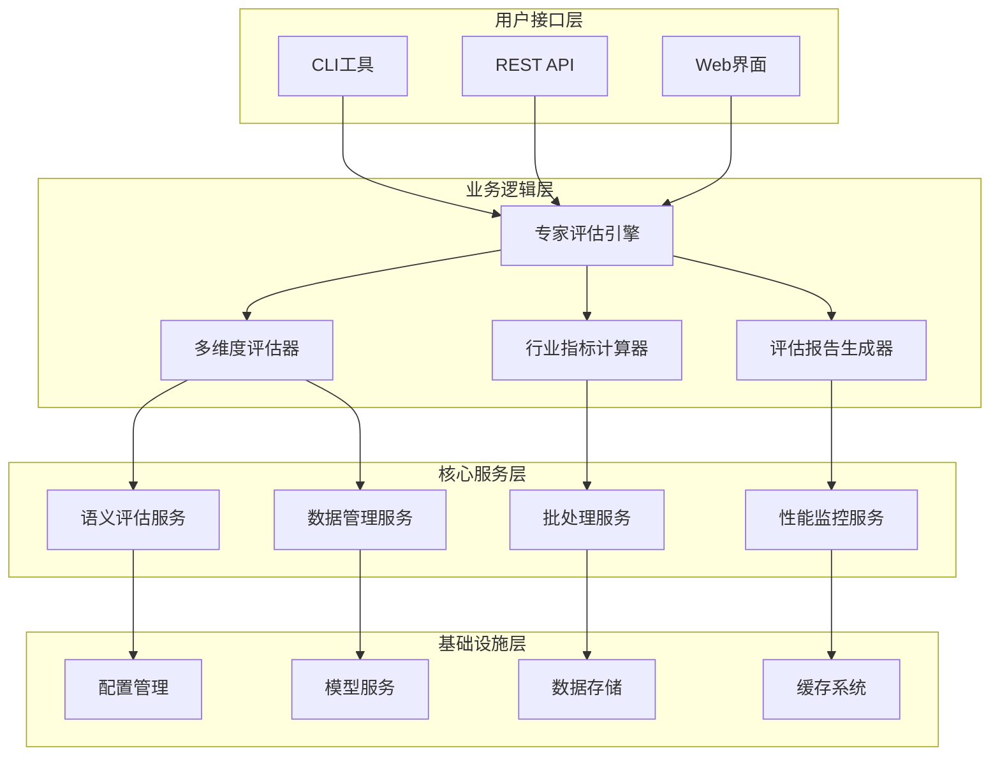
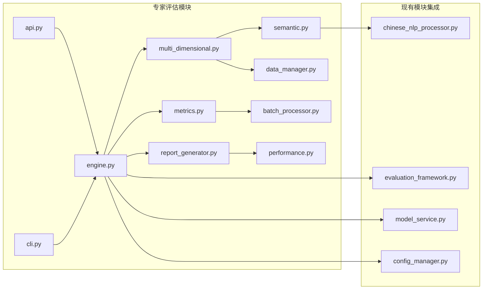
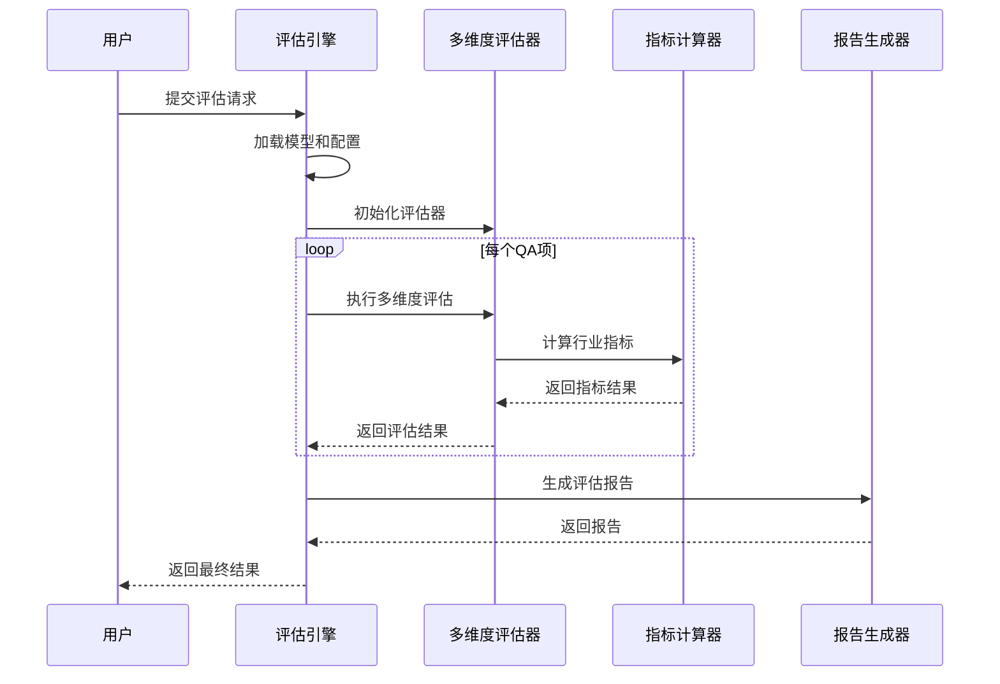
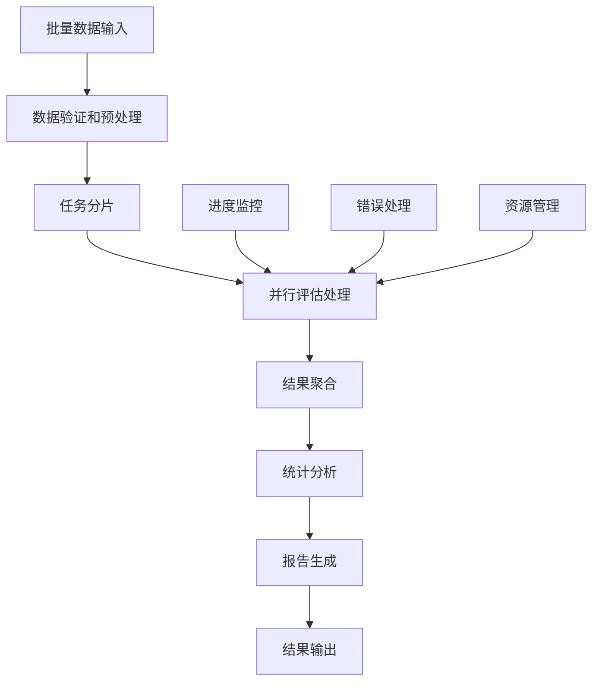
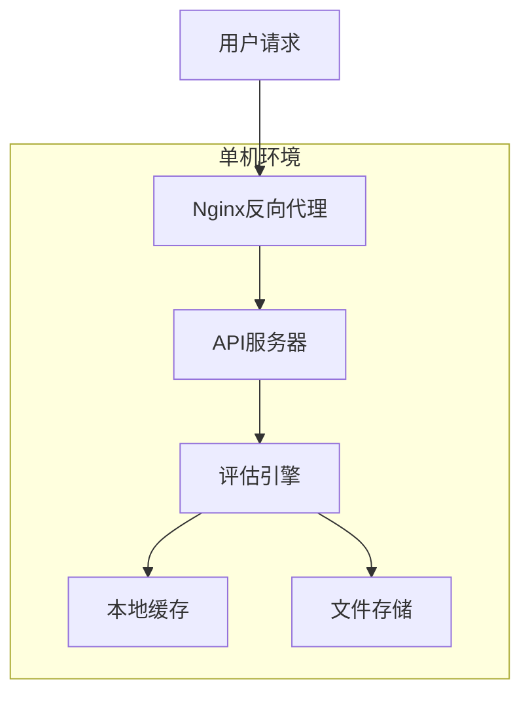
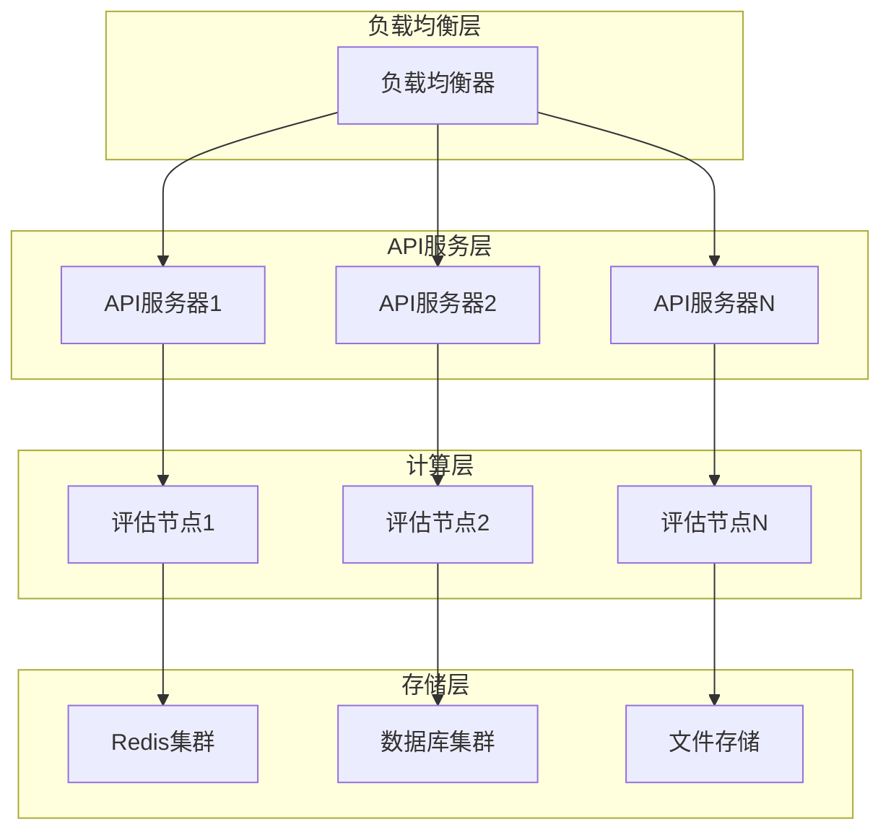

# 专家评估系统架构设计文档

## 概述

专家评估系统是一个全面的行业化评估框架，专门用于评估训练后已合并的最终模型。系统采用模块化设计，提供比传统BLEU、ROUGE更适合行业场景的多维度评估能力。

## 系统架构

### 整体架构图



### 模块依赖关系



## 核心组件设计

### 1. 专家评估引擎 (ExpertEvaluationEngine)

**职责:**
- 协调整个评估流程
- 管理模型加载和初始化
- 控制评估任务的执行
- 处理异常和错误恢复

**关键接口:**
```python
class ExpertEvaluationEngine:
    def __init__(self, config: ExpertEvaluationConfig)
    def load_model(self, model_path: str) -> bool
    def evaluate_model(self, qa_data: List[QAItem]) -> ExpertEvaluationResult
    def batch_evaluate(self, qa_datasets: List[QADataset]) -> BatchEvaluationResult
```

**设计模式:**
- 单例模式：确保全局唯一的引擎实例
- 策略模式：支持不同的评估策略
- 观察者模式：支持评估进度监控

### 2. 多维度评估器 (MultiDimensionalEvaluator)

**职责:**
- 整合所有评估维度
- 管理评估权重配置
- 计算综合评分
- 提供评估结果分析

**评估维度:**
- 语义相似性 (Semantic Similarity)
- 领域准确性 (Domain Accuracy)
- 响应相关性 (Response Relevance)
- 事实正确性 (Factual Correctness)
- 完整性 (Completeness)
- 创新性 (Innovation)
- 实用价值 (Practical Value)
- 逻辑一致性 (Logical Consistency)

**算法设计:**
```python
def calculate_overall_score(self, dimension_scores: Dict[str, float], 
                          weights: Dict[str, float]) -> float:
    """
    综合评分计算算法:
    1. 加权平均计算基础分数
    2. 应用置信区间调整
    3. 考虑统计显著性
    4. 返回最终评分和置信度
    """
```

### 3. 行业指标计算器 (IndustryMetricsCalculator)

**职责:**
- 计算行业特定指标
- 评估领域相关性
- 分析实用性和创新性
- 提供专业术语准确性评估

**核心算法:**

#### 领域相关性计算
```python
def calculate_domain_relevance(self, answer: str, domain_context: str) -> float:
    """
    算法步骤:
    1. 提取领域关键词和概念
    2. 计算概念覆盖度
    3. 分析术语使用准确性
    4. 评估上下文一致性
    """
```

#### 创新性评估
```python
def evaluate_innovation_level(self, answer: str, baseline_answers: List[str]) -> float:
    """
    算法步骤:
    1. 与基准答案进行差异性分析
    2. 识别新颖观点和方法
    3. 评估创新程度的合理性
    4. 计算创新性得分
    """
```

### 4. 高级语义评估器 (AdvancedSemanticEvaluator)

**职责:**
- 深度语义理解分析
- 逻辑一致性检查
- 概念覆盖度评估
- 上下文理解能力测试

**技术实现:**
- 基于预训练语言模型的语义嵌入
- 图神经网络用于概念关系建模
- 逻辑推理引擎用于一致性检查
- 注意力机制用于关键概念识别

## 数据流设计

### 评估数据流



### 批处理数据流



## 性能设计

### 并发处理设计

**多线程架构:**
- 主线程：负责任务调度和结果聚合
- 评估线程池：并行处理QA项评估
- I/O线程池：处理文件读写和网络请求
- 监控线程：实时监控系统性能

**内存管理:**
- 分批加载大数据集
- 及时释放中间结果
- 使用内存映射文件处理超大数据
- 实现LRU缓存机制

### 缓存策略

**多级缓存设计:**
```python
class CacheManager:
    def __init__(self):
        self.l1_cache = {}  # 内存缓存 (最近使用)
        self.l2_cache = {}  # 磁盘缓存 (持久化)
        self.l3_cache = {}  # 分布式缓存 (可选)
    
    def get_cached_result(self, key: str) -> Optional[Any]:
        # L1 -> L2 -> L3 -> 计算
        pass
```

**缓存策略:**
- 模型推理结果缓存：1小时TTL
- 评估配置缓存：30分钟TTL
- 中间计算结果缓存：15分钟TTL
- 最终评估结果缓存：24小时TTL

## 扩展性设计

### 插件架构

```python
class EvaluationPlugin:
    """评估插件基类"""
    def __init__(self, config: Dict[str, Any]):
        pass
    
    def evaluate(self, qa_item: QAItem) -> Dict[str, float]:
        """实现具体的评估逻辑"""
        raise NotImplementedError
    
    def get_metrics_info(self) -> Dict[str, str]:
        """返回插件提供的指标信息"""
        raise NotImplementedError

class PluginManager:
    """插件管理器"""
    def register_plugin(self, plugin: EvaluationPlugin):
        pass
    
    def load_plugins_from_config(self, config: Dict[str, Any]):
        pass
```

### 配置驱动设计

**配置层次结构:**
```yaml
# 全局配置
global:
  model_path: "/path/to/model"
  device: "cuda"
  
# 评估维度配置
dimensions:
  semantic_similarity:
    weight: 0.25
    algorithm: "cosine"
    threshold: 0.7
  
  domain_accuracy:
    weight: 0.25
    algorithm: "bert_score"
    threshold: 0.8

# 插件配置
plugins:
  - name: "custom_evaluator"
    class: "CustomEvaluator"
    config:
      param1: "value1"
```

## 安全性设计

### 数据安全

**敏感数据处理:**
- 输入数据脱敏：自动识别和替换敏感信息
- 传输加密：使用TLS 1.3加密API通信
- 存储加密：评估结果使用AES-256加密存储
- 访问控制：基于角色的权限管理

**隐私保护:**
```python
class DataPrivacyManager:
    def anonymize_qa_data(self, qa_items: List[QAItem]) -> List[QAItem]:
        """数据匿名化处理"""
        pass
    
    def encrypt_results(self, results: EvaluationResult) -> bytes:
        """结果加密存储"""
        pass
    
    def audit_log(self, operation: str, user: str, data_hash: str):
        """审计日志记录"""
        pass
```

### 系统安全

**输入验证:**
- JSON Schema验证输入数据格式
- 文件类型和大小限制
- SQL注入和XSS防护
- 恶意代码检测

**资源保护:**
- 请求频率限制
- 内存使用监控和限制
- CPU使用率控制
- 磁盘空间保护

## 监控和运维

### 监控指标

**系统指标:**
- CPU使用率、内存使用率、磁盘I/O
- GPU利用率、显存使用情况
- 网络带宽、连接数

**业务指标:**
- 评估任务数量、成功率、失败率
- 平均评估时间、吞吐量
- 各维度评分分布
- 用户活跃度

**告警规则:**
```yaml
alerts:
  - name: "high_memory_usage"
    condition: "memory_usage > 90%"
    duration: "5m"
    action: "email,slack"
  
  - name: "evaluation_failure_rate"
    condition: "failure_rate > 10%"
    duration: "2m"
    action: "email,pagerduty"
```

### 日志设计

**日志级别:**
- DEBUG: 详细的调试信息
- INFO: 一般信息记录
- WARNING: 警告信息
- ERROR: 错误信息
- CRITICAL: 严重错误

**日志格式:**
```json
{
  "timestamp": "2024-01-01T12:00:00Z",
  "level": "INFO",
  "module": "expert_evaluation.engine",
  "message": "评估任务开始",
  "task_id": "550e8400-e29b-41d4-a716-446655440000",
  "qa_count": 50,
  "user_id": "user123",
  "trace_id": "abc123def456"
}
```

## 部署架构

### 单机部署



### 分布式部署



### 容器化部署

**Docker Compose配置:**
```yaml
version: '3.8'
services:
  api:
    build: .
    ports:
      - "8000:8000"
    environment:
      - MODEL_PATH=/models
      - REDIS_URL=redis://redis:6379
    volumes:
      - ./models:/models
      - ./data:/data
    depends_on:
      - redis
      - postgres
  
  redis:
    image: redis:7-alpine
    ports:
      - "6379:6379"
  
  postgres:
    image: postgres:15
    environment:
      - POSTGRES_DB=expert_eval
      - POSTGRES_USER=admin
      - POSTGRES_PASSWORD=password
    volumes:
      - postgres_data:/var/lib/postgresql/data

volumes:
  postgres_data:
```

## 最佳实践

### 开发最佳实践

1. **代码组织:**
   - 遵循单一职责原则
   - 使用依赖注入
   - 实现接口隔离
   - 保持代码简洁

2. **测试策略:**
   - 单元测试覆盖率 > 90%
   - 集成测试覆盖关键流程
   - 性能测试验证指标
   - 端到端测试模拟真实场景

3. **文档维护:**
   - API文档自动生成
   - 代码注释完整
   - 架构图及时更新
   - 变更日志详细记录

### 运维最佳实践

1. **监控告警:**
   - 建立完整的监控体系
   - 设置合理的告警阈值
   - 实现自动故障恢复
   - 定期进行演练

2. **性能优化:**
   - 定期性能基准测试
   - 识别和优化瓶颈
   - 合理配置资源
   - 实施缓存策略

3. **安全管理:**
   - 定期安全审计
   - 及时更新依赖
   - 实施访问控制
   - 备份重要数据

## 技术选型说明

### 核心技术栈

**编程语言:** Python 3.12+
- 丰富的机器学习生态
- 优秀的并发处理能力
- 完善的测试框架

**Web框架:** FastAPI
- 高性能异步处理
- 自动API文档生成
- 类型检查支持
- 现代化的开发体验

**数据处理:** Pandas + NumPy
- 高效的数据操作
- 丰富的统计函数
- 良好的内存管理
- 广泛的社区支持

**机器学习:** PyTorch + Transformers
- 灵活的模型定义
- 优秀的GPU支持
- 丰富的预训练模型
- 活跃的开源社区

### 基础设施选型

**缓存:** Redis
- 高性能内存存储
- 丰富的数据结构
- 集群支持
- 持久化选项

**数据库:** PostgreSQL
- ACID事务支持
- 丰富的数据类型
- 优秀的查询优化器
- 强大的扩展能力

**消息队列:** Celery + Redis
- 分布式任务处理
- 灵活的任务调度
- 监控和管理工具
- Python原生支持

**容器化:** Docker + Kubernetes
- 环境一致性
- 弹性伸缩
- 服务发现
- 滚动更新

## 未来发展规划

### 短期目标 (3-6个月)

1. **功能增强:**
   - 支持更多评估维度
   - 增加可视化报告
   - 实现实时评估
   - 优化批处理性能

2. **用户体验:**
   - 改进CLI工具
   - 增加Web界面
   - 提供更多示例
   - 完善文档

### 中期目标 (6-12个月)

1. **平台化:**
   - 多租户支持
   - 用户权限管理
   - 数据隔离
   - 计费系统

2. **智能化:**
   - 自动调参
   - 异常检测
   - 趋势分析
   - 预测建议

### 长期目标 (1-2年)

1. **生态建设:**
   - 插件市场
   - 社区贡献
   - 标准制定
   - 行业合作

2. **技术演进:**
   - 多模态评估
   - 联邦学习
   - 边缘计算
   - 量子计算适配

## 总结

专家评估系统采用现代化的微服务架构，具备高性能、高可用、高扩展性的特点。通过模块化设计和插件架构，系统能够灵活适应不同的评估需求。完善的监控和运维体系确保系统的稳定运行。未来将继续朝着平台化、智能化的方向发展，为用户提供更好的评估体验。